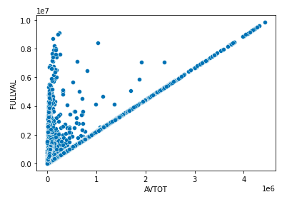
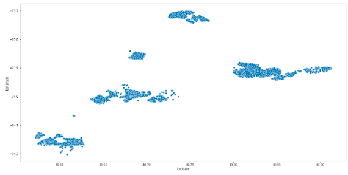
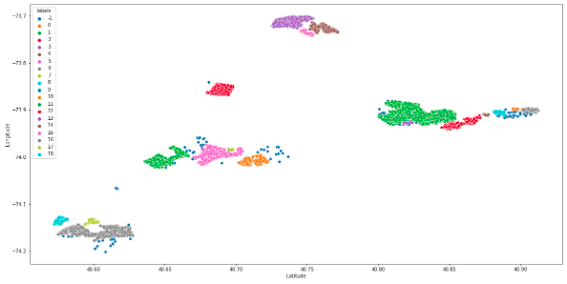

# INFRAPRICE
## Oczyszczene i redukcja wymiarowości 
Oczyszczanie danych to najważniejsza część zadania. Bez dobrze przygotowanych danych, modele
nie będą wstanie wykonywać poprawnych predykcji. Tabela przedstawiająca czym są kolumny, znajduje się poniżej:

| Cecha              | Objaśnienie                                                                                                                                               |
|--------------------|-----------------------------------------------------------------------------------------------------------------------------------------------------------|
| BORO               | Numer kodujący:  1 = MANHATTAN, 2 = BRONX,  3 = BROOKLYN, 4 = QUEENS, 5 = STATEN ISLAND                                                                   |
| Block              | Numer bloku (tego prostokąta z działek): MANHATTAN 1 TO 2,255.  BRONX 2,260 TO 5,958.  BROOKLYN 1 TO 8,955.  QUEENS 1 TO 16,350. STATEN ISLAND 1 TO 8,050 |
| LOT                | Numer działki (unikalny tylko w bloku)                                                                                                                    |
| LTFRONT            | Szerokość działki                                                                                                                                         |
| LTDEPTH            | Głębokość działki                                                                                                                                         |
| STORIES            | Liczba pięter                                                                                                                                             |
| AVLAND             | Faktyczna wartość działki                                                                                                                                 |
| AVTOT              | Całkowita wartość działki                                                                                                                                 |
| EXLAND             | Rzeczywista wartość gruntów zwolnionych z podatku                                                                                                         |
| EXTOT              | Całkowita wartość gruntów zwolnionych z podatku                                                                                                           |
| EASMENT            | Służebności gruntu np. słup energetyczny, studzienka ze światłowodem itp.                                                                                 |
| EXCD1              | Zwolnienie z podatku od nieruchomości                                                                                                                     |
| POSTCODE           | Kod pocztowy                                                                                                                                              |
| BLDFRONT           | Szerokość budynku                                                                                                                                         |
| BLTDEPTH           | Głębokość budynku                                                                                                                                         |
| Latitude           | Szerokość geograficzna                                                                                                                                    |
| Longitude          | Długość geograficzna                                                                                                                                      |
| Community Board    | kategoria (ID wspólnoty mieszkaniowej)l                                                                                                                   |
| Council District - | kategoria (ID rada dzielnicowa)                                                                                                                           |
| Census Tract       | kategoria (ID obszaru spisowego)                                                                                                                          |
| BIN                | NIEZNANA (prawdopodobnie przekształcenie BBL)                                                                                                             |

Część tych zmiennych zostało odrzuconych na starcie. Były to m. in.: 
- POSTCODE
- BIN - nie wiemy jak została stworzona
- Community Board - id, odrzucone po stworzeniu pierwszych modeli
- Council District - id, odrzucone po stworzeniu pierwszych modeli
- Census Tract - id, odrzucone po stworzeniu pierwszych modeli

Kolejne odrzuciliśmy wykorzysując metody Feature Selection (SFS) już tworząc modele oraz dokonując 
ich analalizy (jej cześć znajduje się w pliku `EDA_Kolumn.ipynb`. Z do ciekawszych zależności można zaliczyć:
- Działki, których Całkowita wycena była niewielka, sprzedawane były za kilkukrotnie większą cenę
- W surowym zbiorze danych w dwóch rekordach znajdował się błąd. Rekordy te były przemieszane.

## Feature extraction

### Dystans od gęsto zaludnionych obszarów

W danych o długości i szerekości geograficznej, zauważyliśmy iż większość próbek znajduje
się w dużych aglomeracjach. Użyliśmy więc algorytmu DBSCAN, który idealnie działa na gęstych danych.

Następnie dla tych klastrów obliczyliśmy centroidy i z ich pomocą, każdej próbce przypisaliśmy cechy
`numer klastra` oraz `dystans od najbliższego centroida`.

### Średna wartość sąsiadujących działek

Obliczyliśmy średnią wartość działki w każdym z bloków i tą wartosć zmapowaliśmy do poszczególnych bloków.

### Średnia wartość działki w NTA

Podobnie jak `średna wartość sąsiadujących działek`, lecz agregowaliśmy po NTA.

## Wybór i wytrenowanie modelu uczenia maszynowego

Do trenowania i wyboru uczenia wykorzystaliśmy biblioteke Pycaret. Pozwala na trenowanie
wielu modeli na raz, automatycznie dokonuje ich oceny w wybranym zadaniu (wybierać można spośrod
klasyfikacji i regresjii) i dokonuje automatycznej optymalizacji ich parametrów.

Ponad to wszystko, genrowanie są informacje o najlepszym modelu. Są to:
- Hiperparamery
- Reszty modelu 
- Błędy predykcji
- Feature Selection (ile cech potrzebne było do osiągnęcia

Ze względu na charakter danych, a mianowicie to iż przewidywana zmienna
miała rozstęp rzędu 10^8, zdecydowaliśmy się na użycie **dwóch modeli uczenia maszynowego** 
i połączenie ich. Problem rozpatrzyliśmy oddzielnie dla działek o małej i dużej wartości.

### Model dla działek o małej wartości

Pycaret przetestował ponad 10 modeli z róznymi parametrami, oto kilka najlepszych:

|       | Model                        | MAE             | MSE                    | RMSE            | R2         | RMSLE      | MAPE       | TT (Sec) |
|-------|------------------------------|-----------------|------------------------|-----------------|------------|------------|------------|----------|
| rf       | _Random Forest Regressor_         | 91879.6835     | **75157950525.0227** | **271755.2913** | **0.7612** | 0.5803     | 0.1921     | 0.1110 |
| gbr      | _Gradient Boosting Regressor_     | 109940.0361    | 77655594169.5400     | 275605.0230     | 0.7576     | 1.6571     | 0.6916     | 0.0590 |
| et       | _Extra Trees Regressor_           | **90204.1545** | 77509515134.7706     | 275308.5967     | 0.7528     | 0.4619     | **0.1658** | 0.0820 |
| lightgbm | _Light Gradient Boosting Machine_ | 105504.7647    | 78415199829.5380     | 277671.9795     | 0.7518     | 1.6058     | 0.4278     | 0.0160 |
| dt       | _Decision Tree Regressor_         | 116642.7206    | 135488108436.8586    | 366003.6138     | 0.5656     | **0.4299** | 0.1873     | 0.0090 |
| lr       | _Linear Regression_               | 195443.9910    | 145329496585.6470    | 378875.6922     | 0.5426     | 2.0960     | 4.8058     | 0.0060 |

### Model dla działek o dużej wartości

Podobnie jak wcześniej, Pycaret znalazł modele i sprawdził ich poprawnosć:

|       | Model                        | MAE             | MSE                    | RMSE            | R2         | RMSLE      | MAPE       | TT (Sec) |
|-------|------------------------------|-----------------|------------------------|-----------------|------------|------------|------------|----------|
| ridge | Ridge Regression             | 226956.1887     | **1324960837594.2861** | 950829.0914     | **0.9925** | 0.3149     | 0.1744     | 0.1290   |
| lasso | Lasso Regression             | 200639.7410     | 1439646710728.9299     | 933860.9026     | 0.9917     | 0.2559     | 0.1451     | 0.1410   |
| llar  | Lasso Least Angle Regression | **200612.3341** | 1439635948692.7180     | **933849.3561** | 0.9917     | 0.2559     | 0.1451     | 0.0060   |
| omp   | Orthogonal Matching Pursuit  | 403721.0376     | 2596146442216.0786     | 1331284.7066    | 0.9849     | 0.5192     | 0.4123     | 0.0060   |
| br    | Bayesian Ridge               | 403728.4943     | 2596124293189.0093     | 1331280.3637    | 0.9849     | 0.5192     | 0.4123     | 0.0060   |
| en    | Elastic Net                  | 377227.6426     | 2479064188168.2002     | 1345804.7527    | 0.9828     | 0.3933     | 0.2488     | 0.1120   |
| lr    | Linear Regression            | 414664.8022     | 2574323937028.1821     | 1385260.6314    | 0.9815     | 0.4597     | 0.2881     | 0.1740   |
| et    | Extra Trees Regressor        | 359066.2662     | 31955327371674.9062    | 2610013.3438    | 0.9724     | **0.1719** | **0.0542** | 0.0590   |
